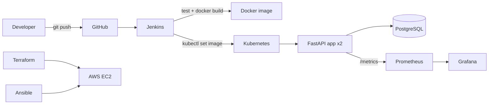
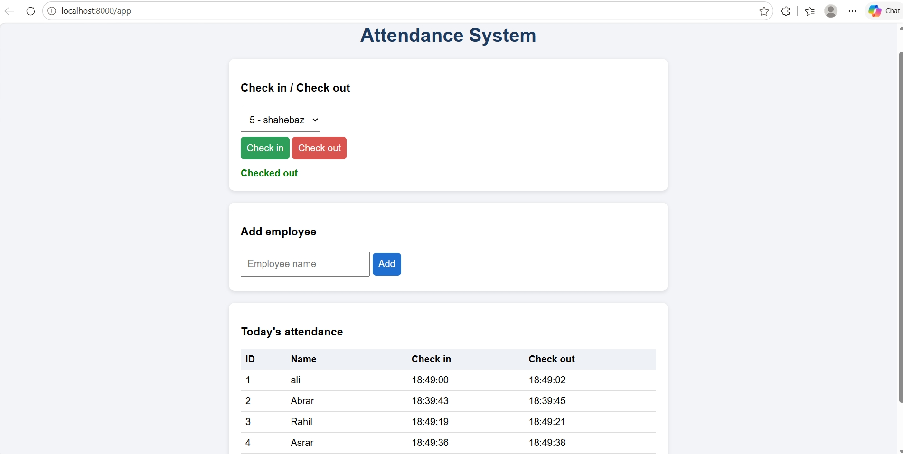
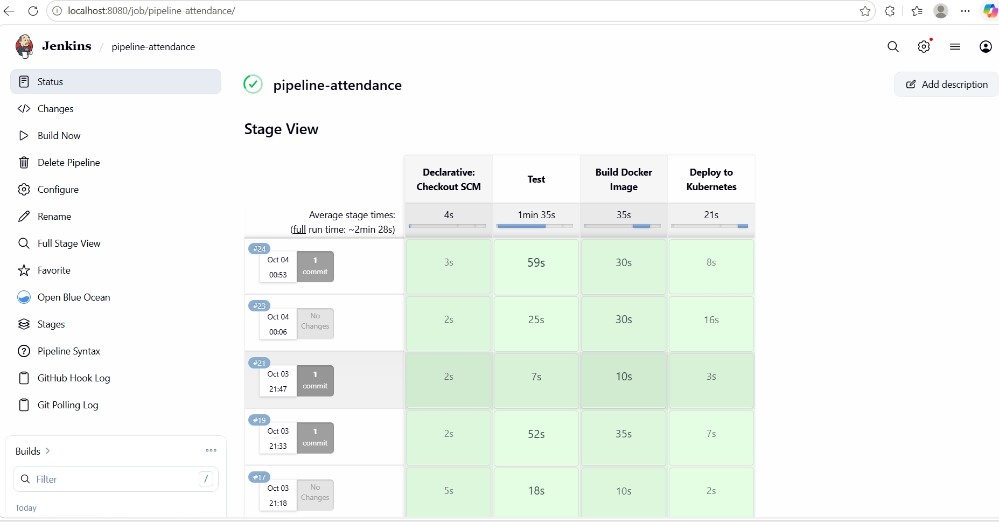
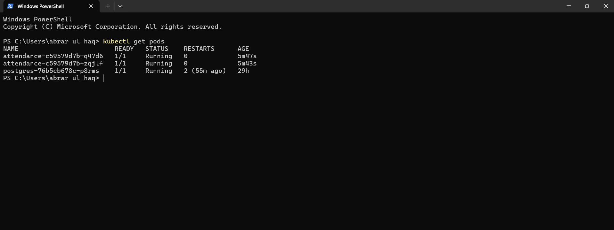
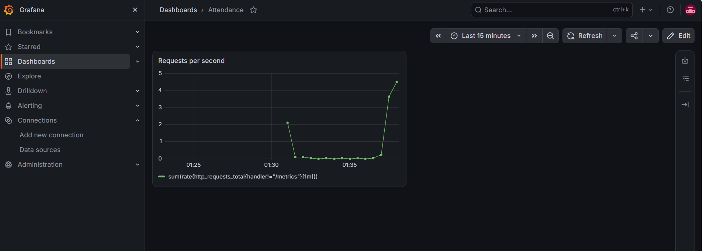

# Online Attendance System (DevOps Project)


- **Author:** Abrar ul haq
- **GitHub:** [abrarulhaqhaq04-stack](https://github.com/abrarulhaqhaq04-stack)

A web-based attendance system with check-in/check-out, daily and monthly reports, deployed through a complete DevOps pipeline.

## Features
- Employee check-in and check-out
- Daily and monthly reports
- Web frontend at `/app`
- Persistent data in PostgreSQL
- Automatic build, test, and deploy with Jenkins
- Live metrics in Prometheus and Grafana

## Architecture



## Tech stack
| Area | Tools |
|---|---|
| App | Python, FastAPI, SQLAlchemy, HTML/JS |
| Database | PostgreSQL |
| Containers | Docker |
| CI/CD | Jenkins, GitHub |
| Orchestration | Kubernetes |
| Infrastructure | Terraform, Ansible, AWS EC2 |
| Monitoring | Prometheus, Grafana |
| OS | Linux (WSL), Windows |

## Screenshots














## API endpoints
| Method | Path | Purpose |
|---|---|---|
| POST | `/employees?name=` | Add employee |
| GET | `/employees` | List employees |
| POST | `/check-in/{id}` | Check in |
| POST | `/check-out/{id}` | Check out |
| GET | `/report/today` | Today's report |
| GET | `/report/monthly?year=&month=` | Monthly report |
| GET | `/metrics` | Prometheus metrics |

## Run locally
```bash
pip install -r requirements.txt
uvicorn main:app --reload
```
Open http://localhost:8000/app

## Deploy on Kubernetes
```bash
docker build -t attendance-app:v4 .
kubectl apply -f k8s/postgres.yml
kubectl apply -f k8s/deployment.yml
kubectl port-forward svc/attendance-service 8000:8000
```

## CI/CD pipeline
1. Push code to GitHub
2. Jenkins runs the tests (pytest)
3. Jenkins builds the Docker image tagged with the build number
4. Jenkins updates the Kubernetes deployment and waits for the rollout

## Infrastructure as Code
- `terraform/` creates the AWS EC2 server and security group
- `ansible/` installs Docker and runs the app on it

## Future work
- Face recognition check-in
- Authentication (JWT)
- CSV export for reports